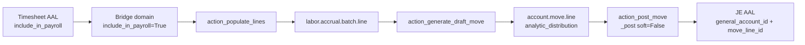

# Executive Summary

Labor accrual + analytic-statement work was implemented and proven on an isolated clone **`trgcc_mm_uat`**. Production **`trgcc` was not written**: 0 module installs, 0 journals, 0 SQL backfills.

Safe UAT timesheets (8h / 6h) produced posted journal **SLR/2026/09/0001**, balanced **640.00 SR**: Dr `410028 Basic Salary - Projects` with project analytic, Cr `202001 ACCRUED SALARIES` with no analytic. Statement is now **AAL-primary**; timesheets without GL render **Timesheet / no GL**.

Industrial P&L Excel remains **CHANGE_REQUEST_REQUIRED**.

# Environment

Production:
`trgcc` (owner odoo, 108 MB, PostgreSQL 16.13) — https://gpc.odoo.com.se

Test:
`trgcc_mm_uat` (owner odoo, 91 MB after restore)

Public names `MM` / `trgulf_Mrp` are **not** Postgres databases on this host. Database selector lists: `entgcc`, `trgcc`, `trgcc_mm_uat`. `entgcc` was not used.

# Safety

- production writes: **0**
- production accounting entries created: **0**
- production modules installed: **0**
- production timesheet count after UAT: **10** (unchanged)
- UAT crons disabled: **49**
- UAT mail servers: none active; catchall `uat-disabled.invalid`

# Baseline Findings

Production `trgcc` (2026-08-11 19:36 UTC):

| Item | Result |
|------|--------|
| Timesheets (`employee_id` set) | **10** |
| `general_account_id` on those 10 | **NULL** |
| `move_line_id` on those 10 | **NULL** |
| `account_id` on those 10 | **set** |
| GL-linked analytic rows | **4** |
| `include_in_payroll` column | **absent** |
| `labor_accrual_batch` | **absent** |
| Labor modules | **not in ir_module_module / not installed** |
| Installed | `legacy_mixed_system`, `gpc_gulf_hr_payroll_ext`, `gpc_gulf_project_ext`, `gcc_timesheet_type`, `hr_timesheet` |
| Logs Worker/Labor accrual / include_in_payroll | **0 matches** |

Timesheet IDs: 29, 30, 32, 48, 49, 53, 54, 55, 58, 59 (hours include 260 / 200 — anomalies).

# Root Causes

1. Odoo timesheets are analytic-only until a JE posts (`general_account_id` stays NULL).
2. Labor accrual stack lived in `/home/sabry/edafa_elhaleej` and was **not on production**.
3. `include_in_payroll` onchange copied `project.use_for_payroll` (default False) → silent exclusion.
4. `period_key` could drift from `period_start`/`period_end` (WP #405).
5. `account.move._post()` default `soft=True` left UAT moves in **draft** while marking the batch posted.
6. Analytic statement was **AML-primary**.

# Code Changes

Branch: `gulf-mm-uat-20260811`

| Commit | Message |
|--------|---------|
| `f5bb343` | fix(timesheet): preserve payroll eligibility on project onchange |
| `571a56e` | fix(labor-accrual): keep period key and dates synchronized |
| `2420797` | fix(analytic-statement): use analytic lines as primary source |
| `accd2fe` | test(mm): add labor accrual and statement UAT coverage |
| (this commit) | test(mm): adapt labor/statement tests to Odoo 19 schema |

Accounting design (unchanged, documented):

```
Dr Labor expense  (analytic = project)
Cr Accrued salaries / clearing  (no analytic)
```

Credit analytic is **not** added (would double-count project P&L).

# Module Versions

| Module | Source version installed on UAT |
|--------|----------------------------------|
| workers_timesheet | 19.0.1.1.0 |
| gpc_hr_timesheet_labor_accrual | 19.0.1.0.7 |
| gpc_worker_timesheet_labor_accrual_bridge | 19.0.1.0.0 |
| report_xlsx | 19.0.1.0.0 |
| gpc_analytic_project_statement | 19.0.1.7.0 |

# Test Database Creation

- Dump: `/var/backups/gulf_mm_uat/trgcc_20260811_223821.dump`
- Size: **9716737 bytes (9.3M)**
- Timestamp: **2026-08-11T22:38:21+03:00**
- PostgreSQL: 16.13
- Source owner: odoo
- Filestore copied: `/var/lib/odoo/filestore/trgcc_mm_uat` (19M)
- Restore exit: **0**
- UAT AAL count after restore: **14** (same as prod)

# Labor Accrual UAT

Safe records (not the 200h/260h lines):

| AAL | Name | Hours | Flag | Amount |
|-----|------|------:|------|-------:|
| 159 | UAT MM eligible 8h | 8 | True | -400 |
| 160 | UAT MM eligible 6h | 6 | True | -240 |
| 161 | UAT MM excluded | 8 | False | -400 |

- Batch **5** `UAT MM labor accrual 2026-09`, `period_key=2026-09` (forced from dates; stale `2099-01` overwritten)
- Populate: 2 lines, total **640.00** (excluded 161 skipped)
- Move **196** `SLR/2026/09/0001` **posted**, journal SLR (23)
- AML 921 Dr 240 account 131 analytic `{78:100}`; AML 922 Dr 400 account 131 analytic `{77:100}`; AML 923 Cr 640 account 57 **no analytic**
- Posted AAL 162/163: `general_account_id=131`, `move_line_id` 921/922
- Original timesheets 159/160 still `general_account_id` NULL (source hours unchanged)
- Second active batch for 2026-09: **blocked** (ValidationError)

`include_in_payroll` after install defaulted **True** on existing UAT rows (column default). No historical SQL was run.

# Include in Payroll Fix

- Default remains True
- Onchange / create / write: True unless `project.exclude_from_payroll`
- Does **not** copy `use_for_payroll`

# Period Key Fix

- `period_key` always `YYYY-MM` from `period_start`
- Same-calendar-month constraint on batch and wizard
- Populate domain uses dates (Jan 14/21 unit test added)

WP **#405 not closed** (original 600h / batch 444 evidence is a different snapshot).

# Accounting Verification

Existing GCC COA used (not invented):

| Role | ID | Name |
|------|----|------|
| Debit expense | 131 | Basic Salary - Projects (code 410028) |
| Credit clearing | 57 | ACCRUED SALARIES (code 202001) |
| Journal | 23 | Salaries (SLR) |

Industrial bucket mapping (مواد / overhead / مبيعات) is **FINANCE_MAPPING_REQUIRED** and was not guessed.

# Analytic Statement Fix

`_get_report_phase1_rows` is **AAL-primary**. AML explosion only if no AAL has that `move_line_id`.

UAT September rows (5): 2 eligible timesheets + 1 excluded timesheet (Timesheet / no GL) + 2 JE AAL (410028). `duplicate_aml=False`.

Financial **sum** of timesheet amounts **plus** JE AAL would double labour if used as a P&L. Transaction listing is intentional; P&L Excel is out of scope.

# Reconciliation

| Check | Result |
|-------|--------|
| Populate total | 640.00 |
| JE debit | 640.00 |
| JE credit | 640.00 |
| Posted | yes |
| Debit analytic | yes (two projects) |
| Credit analytic | empty |
| Prod `trgcc` journals | unchanged |

# Historical Data Anomalies

UAT clone (do **not** accrue until reviewed):

| id | date | hours |
|----|------|------:|
| 58 | 2026-01-31 | 260 |
| 29 | 2026-03-04 | 200 |
| 32 | 2026-03-04 | 200 |
| 30 | 2026-03-04 | 100 |
| 48 | 2026-02-28 | 43 |
| 49 | 2026-02-28 | 40 |
| 53 | 2026-04-08 | 25 |

Counts: ts=19 on UAT (10 cloned + UAT extras), gt24=7, eq200=2, eq260=1, nonpos=0.

No historical SQL on production. No historical SQL flag update on UAT (defaults already True).

# Screenshots

Folder: `/home/sabry/evidence/gulf_mm_uat_20260811/screenshots/`

Replacement UI proof (not home-page substitutes):

| File | What it proves |
|------|----------------|
| `21_timesheet_form_include_in_payroll.png` | Timesheet 159 form, **Include in Payroll** checked, Worker & payroll group |
| `22_project_onchange_optout_payroll_false.png` | New timesheet, project OptOut → Include in Payroll **unchecked** |
| `23_project_onchange_alpha_payroll_true.png` | Same form, project Alpha → Include in Payroll **checked** |
| `24_project_exclude_from_payroll.png` | Project OptOut form, **Exclude from payroll** checked |
| `25_company_labor_accrual_config.png` | Company Labor Accrual tab: 410028 / 202001 / Salaries |
| `26_analytic_statement_wizard.png` | Analytic Project Statement wizard (Export XLSX) |
| `27_timesheets_list_payroll_column.png` | All Timesheets list with Include in Payroll column |
| `29_statement_rows_timesheet_and_je.png` | Sept 2026 rows: Timesheet / no GL (yellow) + JE `SLR/2026/09/0001` once per project debit (blue, source=aal) |

JSON of the same rows: `sql/statement_rows.json` (5 rows, 3 Timesheet/no GL, 2 JE AAL, 0 AML duplicates).

Retroactive / company / statement replacements: `30`–`42` (DB selector `trgcc_mm_uat`, candidate 153, batch 6, JE `SLR/2026/08/0001`, AAL 383 Financial Account 410028, wizard, Aug before/after, Feb material, 65/65 tests, wrong-company guard).

# SQL Evidence

`/home/sabry/evidence/gulf_mm_uat_20260811/sql/` plus `before_after/e2e_result.json`.

# Logs

- Install: UAT modules installed; description HTML missing was fixed; no remaining CRITICAL after retry
- E2E: Worker accrual populate summary in Odoo logs
- Tests: `/home/sabry/evidence/gulf_mm_uat_20260811/logs/tests.log`

# Transcript Gap Review

Meeting asked for: missing-GL **why**, where Include in Payroll is used, retroactive solution, company-context safety, statement on old + remediated data. Those are covered below.

Industrial P&L Excel is **not** in this scope (client refused).

# Historical Missing-GL Root Causes

Full table: `docs/HISTORICAL_AAL_ROOT_CAUSE.md` and `evidence/.../HISTORICAL_AAL_ROOT_CAUSE.md`.

20 AAL with analytic `account_id` and `general_account_id` NULL.

| Primary cause | Count | IDs |
|---------------|------:|-----|
| Anomalous hours (legacy, never accrued, hourly_cost=0) | 7 | 29, 30, 32, 48, 49, 53, 58 |
| No amount source (`hourly_cost=0`) | 3 | 54, 55, 59 |
| `include_in_payroll` false | 3 | 155, 158, 161 |
| JE never generated (cancelled/empty August batch) | 4 | 153, 154, 156, 157 |
| Accrued; source timesheet has no GL **by design** | 2 | 159, 160 (GL on AAL 162/163) |
| Zero hours | 1 | 313 |

**Why:** Odoo timesheets stay analytic-only until a **new** JE-linked AAL is posted. Labor stack was not on production. Original employees have `hourly_cost=0`.

# Include in Payroll End-to-End Trace



| Step | Model / field / method | File |
|------|------------------------|------|
| Flag on form | `account.analytic.line.include_in_payroll` | `workers_timesheet/models/account_analytic_line.py` 52–56; views `hr_timesheet_views.xml` 15, 32 |
| Default / onchange | `_include_in_payroll_from_project`, `_onchange_project_id`, `create`, `write` | same file 90–125 |
| Project opt-out | `project.project.exclude_from_payroll` | `workers_timesheet/models/project_project.py` |
| Eligibility domain | `_get_eligible_timesheet_domain` + `("include_in_payroll", "=", True)` | `gpc_hr_timesheet_labor_accrual/.../labor_accrual_batch.py` 216–239; bridge `gpc_worker_timesheet_labor_accrual_bridge/models/labor_accrual_batch.py` 15–23 |
| Populate | `action_populate_lines` | bridge 74–146 |
| Company accounts/journal | `_get_company_labor_accrual_config` (company-ownership guard) | labor batch 295–349 |
| Draft JE | `action_generate_draft_move` → `_prepare_labor_accrual_move_vals` | 657–698, 548–655; debit AML `analytic_distribution` |
| Post | `action_post_move` → `account.move._post(soft=False)` | 717+ |
| Financial account | Posted AAL `general_account_id` / `move_line_id` (not rewritten on the timesheet) | UAT AAL 162/163 and 382/383 |

Runtime proof: Sept batch 5 skipped 161 (payroll false); Aug batch 6 skipped 155/158; 153/154 populated.

# Retroactive Remediation UAT

Backup before remediation:

`/var/backups/gulf_mm_uat/trgcc_mm_uat_before_retro_20260811_231409.dump`  
size **9782815** bytes, timestamp **2026-08-11 23:14:11 +03:00**

| | Before | After |
|--|-------:|------:|
| Timesheets (employee set) | 20 | 20 |
| AAL with GL | 6 | 8 |
| Timesheets still no GL | 20 | 20 (by design) |

- Selected: **153, 154** (8h/6h, payroll true, amount -400/-240)
- Held out of sample: **156, 157** (same pattern, not mass-posted)
- Excluded anomalies: 29, 30, 32, 48, 49, 53, 58 and 25h/40h/43h/100h/200h/260h
- Excluded no-rate: 54, 55, 59 (`hourly_cost=0` — would invent rates)
- Excluded payroll false: 155, 158, 161
- Excluded zero hours: 313
- Already posted Sept: 159, 160

- Batch **6** `period_key=2026-08` posted
- Move **291** `SLR/2026/08/0001` posted, total **640.00**
- AML 1121 Dr 400 account 131 analytic `{73:100}`; AML 1120 Dr 240 account 131 `{74:100}`; AML 1122 Cr 640 account 57 **no analytic**
- Resulting AAL **383** / **382**: `general_account_id=131`, `move_line_id` 1121/1120
- Source 153/154 remain `general_account_id` NULL

JSON: `before_after/retro_result.json`

# Multi-Company Safety

- Batch and populate domain filter `company_id` = batch company.
- Company form domains: accounts `company_ids in [id]`; journal `company_id = id`.
- **Generate-time guard** (new): journal must be batch company; debit/credit accounts must belong to batch company; timesheet lines from another company raise `UserError`.
- Tests: `test_generate_blocks_foreign_company_journal`, `test_generate_blocks_foreign_company_debit_account`, `test_generate_blocks_timesheet_from_other_company` — all PASS.
- UAT has a single company **GCC** (id 1). Wrong-company case is proven by automated tests (SQL bypass of ORM then generate must block).

# Historical Statement Validation

Aug **before** JE: 7 rows, all `Timesheet / no GL`, source `aal`, no SLR/2026/08.

Aug **after**: same 7 + **2** rows `SLR/2026/08/0001` account `410028 Basic Salary - Projects`, source `aal`, `aml_id` set. `aug_aml_fallback_count=0`. JE not doubled.

Feb material: AAL 12 `INV/2026/00003` / 13 `INV/2026/00009` account `500001 INCOME FROM PROJECTS`, source `aal`.

Sept (unchanged): Timesheet/no GL + `SLR/2026/09/0001` once per project debit.

# Final Automated Tests

`trgcc_mm_uat`: **0 failed, 0 error(s) of 110 tests.**

Justified SKIP (2): AAL journal date vs AML line_date; no `mrp_production_id`.

# Excel Template Styling

Mohammad’s `تقرير الصناعي.xlsx` is used as **visual/layout template only**.

Status: **`EXCEL_TEMPLATE_STYLE_ONLY_APPROVED`**

Not implemented: Industrial P&L calculations, new GL mappings, مواد / أجور / overhead / مبيعات / صافي الربح columns.

XLSX (`gpc_aps.proj_stmt_xlsx` v19.0.1.8.0): RTL, Arabic headers on the **existing** six fields, blue header, borders, alt rows, frozen header, landscape fit-to-width, totals = sum of shown debit/credit.

UAT export: `xlsx/gulf_mm_analytic_statement.xlsx` (26 rows, debit 7700, credit 106000 = Phase-1 JSON).

# Existing Field Mapping

| Report key | XLSX header |
|------------|-------------|
| date | التاريخ / Date |
| move_name | رقم الحركة / Transaction / Move Number |
| project | المشروع / Project |
| account | الحساب / Account |
| debit | مدين / Debit |
| credit | دائن / Credit |

# Visual Comparison

See `docs/EXCEL_TEMPLATE_VISUAL_COMPARISON.md` and screenshots 43–47.

# Accounting Logic Impact

`Accounting/business logic changes from Excel template: NONE`

# Explicitly Refused Scope

Industrial P&L **calculations / new fields / account mappings** remain refused.

Visual reuse of the Excel file: **`EXCEL_TEMPLATE_STYLE_ONLY_APPROVED`**

# Extended UAT dataset

Marker `gulf.mm.uat.extended_dataset.v1` on `trgcc_mm_uat` only.

| Item | Count |
|------|------:|
| MM-UAT projects | 11 (10 GCC + WRONGCO) |
| MM-UAT employees | 12 |
| MM-UAT timesheets | 124 |
| Payroll eligible | 121 |
| Payroll excluded | 3 |
| Anomalies >24h | 5 |
| Posted labor JEs | 4 (Apr/May/Jun/Dec guard) |
| Draft labor JE | 1 (Oct) |
| Material MISC | 3 |
| Statement rows Apr–Oct | 154 |
| Automated tests | 110 |
| Manual scenarios | 36 PASS |
| Meeting points mapped | 15 testable + 3 NOT_TESTABLE |

Docs: `MEETING_REQUIREMENTS_TRACEABILITY.md`, `GULF_MM_MANUAL_UAT_SCENARIOS.md`, `UAT_TEST_DATA_INVENTORY.md`, `ANALYTICAL_VS_JOURNAL_PROOF.md`.

`Accounting/business logic changes from Excel template: NONE`

# Labor anomaly hours guard

Populate **excludes** (does not delete or rewrite) timesheets when:

- a single line has `unit_amount > 24` (24.00 is allowed)
- multiple lines for the same employee + date sum to more than 24 hours (all lines in that group are excluded)

`action_generate_draft_move` also refuses any injected batch line that still points at anomalous hours.

UAT MM-UAT-036 (`2026-12` inside the batch period): 25/40/100/200/260h and 16+16 cumulative were **not** accrued. Normal 8h+6h posted as `SLR/2026/12/0001` **640.00**. Anomalous rows still exist with original hours.

# Known Limitations

- Timesheet rows and JE AAL both appear on the statement (hours vs posted cost). Listing, not an Industrial P&L.
- `_post(soft=False)` required on this Odoo 19+e.
- `validated=True` required for populate.
- Odoo 19 AAL has no SQL column `analytic_distribution` (JSON is on AML).
- Original GCC `hourly_cost=0` blocks JE for cloned Jan–Apr timesheets without Finance rates.

# Production Deployment Plan

WAIT FOR SABRY **EXPLICIT** APPROVAL. Do not deploy yet.

1. Backup `trgcc` again.
2. Deploy branch modules to `/opt/localaddons`.
3. `-i` on a **new** clone first.
4. Configure company labor accounts (131 / 57 / SLR) only after Finance confirms.
5. Anomalous `unit_amount > 24` and same-day cumulative `> 24` are excluded by populate. Do **not** invent hourly_cost.

# Rollback Plan

- UAT: restore `trgcc_mm_uat_before_retro_20260811_231409.dump` or original `trgcc_20260811_223821.dump`.
- Production: no changes to roll back.

# OpenProject

- Parent: [#88](https://master.tailcf9988.ts.net:10081/work_packages/88)
- This work: [#441](https://master.tailcf9988.ts.net:10081/work_packages/441)
- [#405](https://master.tailcf9988.ts.net:10081/work_packages/405) — **not closed**

# Git Commits

https://github.com/sabryyoussef/edafa_elhaleej/tree/gulf-mm-uat-20260811

`f5bb343`, `571a56e`, `2420797`, `accd2fe`, `597db40`, plus company-guard and docs commits on this branch.

# Final Verdict

`GULF_MM_EXTENDED_UAT_FINAL_PASS_READY_FOR_PROD_APPROVAL`

Production recommendation: **do not deploy** until Sabry gives explicit production approval.
